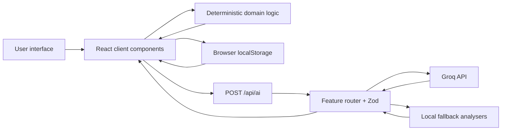
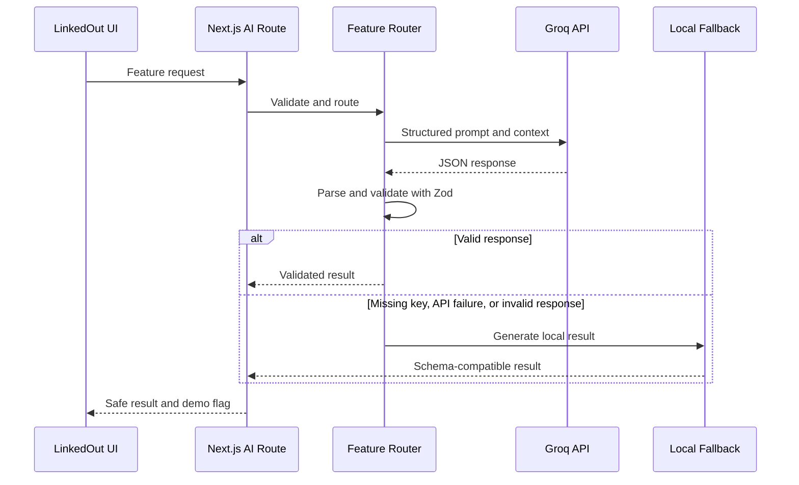

# LinkedOut

> Professional networking, without the professional theatre.

<p align="center">
  
  
  
  
  
  
</p>

LinkedOut is a frontend-heavy, AI-powered professional-networking prototype. It borrows the familiar interaction patterns of professional-network platforms—feeds, profiles, jobs, connections, endorsements, and notifications—while using original branding, mock data, and a less reverent personality. Its unusual tools use Groq to examine corporate writing, visualize career growth, audit professional favours, review endorsement evidence, and interpret job compatibility.

The project was built as a high-fidelity cohort prototype across three phases. It has no database or authentication requirement: interactive state lives in React and `localStorage`, while a small server-side Next.js Route Handler protects the Groq API key. Every AI feature also has a deterministic or template-based fallback so the demo remains usable without external AI access.

## Table of contents

- [Overview](#overview)
- [Why LinkedOut](#why-linkedout)
- [Core experience](#core-experience)
- [Features](#features)
  - [Standard professional-network experience](#standard-professional-network-experience)
  - [Humble-Brag Polygraph](#humble-brag-polygraph)
  - [Career Plant Growth](#career-plant-growth)
  - [Network Debt Collector](#network-debt-collector)
  - [Endorsement Cross-Examiner](#endorsement-cross-examiner)
  - [Corporate Horoscope Matcher](#corporate-horoscope-matcher)
- [Technology stack](#technology-stack)
- [Application architecture](#application-architecture)
- [AI architecture](#ai-architecture)
- [Routes](#routes)
- [Data and persistence](#data-and-persistence)
- [Local setup](#local-setup)
- [Environment variables](#environment-variables)
- [Available scripts](#available-scripts)
- [Project structure](#project-structure)
- [Recommended demo flow](#recommended-demo-flow)
- [Fallback mode](#fallback-mode)
- [Design system](#design-system)
- [Accessibility](#accessibility)
- [Responsive design](#responsive-design)
- [Security and privacy](#security-and-privacy)
- [Prototype limitations](#prototype-limitations)
- [Roadmap](#roadmap)
- [Development notes](#development-notes)

## Overview

LinkedOut is a cohort project and high-fidelity product prototype, not a production social network. It resembles the information density and navigation conventions of LinkedIn without copying its logo, name, or visual identity. The interface uses an original blue `LO` mark, original copy, fictional companies, and mock professional histories.

The repository includes:

- A responsive feed, profile, network, and job-search interface.
- Mock people, posts, companies, roles, endorsements, projects, and relationship accounts.
- Five experimental AI features routed through one server endpoint.
- Deterministic scoring for plant growth, relationship balances, endorsement evidence, and job compatibility.
- Browser-local persistence with hydration-safe loading and reset controls.
- Local fallbacks for presentations without a configured Groq key.

No database is necessary for the current scope because all data is seeded locally and mutations are prototype-only.

## Why LinkedOut

Professional networks are useful, but their conventions can also produce corporate language, performative announcements, weak endorsements, transactional networking, opaque culture signals, and profiles that do not show how a career is actually developing.

LinkedOut turns those patterns into interactive product ideas without treating professional networking—or its users—as the enemy:

- Corporate prose becomes a writing-style analysis.
- Career activity becomes an explorable digital plant.
- Professional favours become a satirical relationship ledger.
- Endorsements become evidence-aware testimony.
- Job matching becomes useful compatibility analysis in a horoscope costume.

The satire is the interface layer; underneath it, the product still surfaces practical signals and next actions.

## Core experience

1. Browse a familiar professional feed.
2. Draft a post through the Humble-Brag Polygraph.
3. See skills, projects, achievements, and learning activity shape a Career Plant.
4. Review connection history in the Relationship Ledger.
5. Cross-examine endorsements for specificity and supplied evidence.
6. Compare profiles, companies, roles, and work preferences through the Corporate Horoscope Matcher.

## Features

### Standard professional-network experience

- Sticky desktop navigation with Home, My Network, Jobs, Messaging, Notifications, and Me.
- Compact mobile navigation and responsive page shells.
- Three-column desktop feed with profile summary, main feed, news, and connection suggestions.
- Mock current-user profile with analytics, experience, projects, skills, and Career Garden entry point.
- Five seeded feed posts with varied professional content and CSS-built previews.
- Post composer with Standard and Polygraph modes.
- User-created posts placed at the top of the feed and saved locally.
- Persistent like state; expandable comments; repost and share-menu feedback.
- Toasts, loading skeletons, modal interfaces, full-height drawers, and empty states.
- Full My Network page with invitations, connection suggestions, recent connections, and Relationship Ledger entry point.
- Job search with title/skill/company search, location, experience, workplace filters, saved jobs, and saved readings.
- Polished preview pages for Messaging and Notifications. These are not connected to real services.

Comment entries, invitation actions, and suggestion buttons are in-memory prototype interactions. Repost and share controls show UI feedback; they do not publish or send anything externally.

### Humble-Brag Polygraph

The composer can analyze professional post text after a 900 ms debounce. It requires at least 25 characters, cancels stale requests, and avoids re-analyzing identical text and Savage Mode combinations.

The result includes:

- Humble-brag, corporate-speak, and authenticity scores.
- A writing-style verdict and playful commentary.
- Suspicious phrase chips with translations and severity.
- A plain-language section titled **What you actually mean**.
- An honest rewrite that can replace the current draft.
- Savage Mode for sharper—but still non-abusive—commentary.
- An animated mechanical gauge, trembling loading needle, and moving polygraph waveform.

```text
Input:
“Thrilled and humbled to announce that I am beginning a new chapter.”

Interpretation:
“I got a new job and would like everyone to notice.”
```

The interpretation is satire based on writing style. It is not a factual claim about the author’s private intent. Without Groq, a phrase-and-punctuation heuristic produces the same result shape and the UI displays **Demo analysis**.

### Career Plant Growth

The Career Plant converts typed professional activity into an original, responsive SVG illustration. The visual state is calculated locally; Groq does not draw the plant or decide its geometry.

| Activity | Plant signal |
| --- | --- |
| Completed projects | Branches |
| Skills | Leaves |
| Verified skills | Stronger leaves |
| Endorsements and evidence | Visible root strength |
| Major achievements | Flowers |
| Helpful posts | Additional shoots/leaves |
| New connections | Surrounding sprouts |
| Learning activity | Health score |

Plant levels map to the implemented states **Seedling**, **Growing**, **Branching**, **Blooming**, and **Thriving**. Category-weighted projects and evidence determine the dominant AI, frontend, backend, product, or research branch.

The `/greenhouse` experience provides:

- Keyboard- and touch-inspectable leaves, branches, flowers, and roots.
- Text equivalents for skill, project, achievement, endorsement, and foundation signals.
- Persistent growth history.
- Demo controls for completing a project, adding or verifying a skill, receiving an endorsement, publishing a helpful post, and recording a learning day.
- A reset action for restoring seeded growth data.
- Career Gardener advice with a strongest area, neglected area, and exactly three next actions.

The profile contains a smaller Career Garden preview, while the Greenhouse reads and updates the persisted activity model.

### Network Debt Collector

The Relationship Ledger is a satirical professional connection manager built around six mock accounts. It records favours given and received—introductions, feedback, referrals, project help, resources, and other support—alongside promises, reply age, and ignored asks.

The deterministic balance function calculates:

- Whether they owe you, you owe them, or the account is balanced.
- Relationship health.
- Overdue-promise count.
- Low, medium, or high ghosting risk.
- Account statuses such as in good standing, payment pending, overdue, and collections candidate.

The `/collections` route includes summary cards, search, All/They owe you/You owe them/Balanced/Overdue/Ghosted filters, detailed account drawers, favour receipts, promise fulfilment, and local favour creation.

Eligible accounts can open a draft-only follow-up studio with five tones:

1. Friendly nudge
2. Polite reminder
3. Mild guilt
4. Corporate passive-aggression
5. Final notice

Groq or a template fallback generates an account summary and professional draft. Copy places the text on the clipboard; Save draft writes it to local storage. LinkedOut never sends the message and never represents the mock balance as a legal debt.

> Human relationships are not financial accounts, despite what the spreadsheet suggests.

### Endorsement Cross-Examiner

The profile’s skill cards show endorsement counts, evidence counts, recent witnesses, and a status derived from reviewed testimony. Starting an endorsement opens a six-step flow:

1. Select how the witness knows the candidate’s work.
2. Record whether the skill was personally observed.
3. Select a profile project or no project.
4. Describe a specific contribution; at least 20 characters are required.
5. Select project, repository, collaboration, post, certificate, or no evidence.
6. Review and submit the testimony.

Evidence scoring rewards direct observation, matched profile projects, specific contribution descriptions, suitable evidence, and witness confidence. It returns the statuses **Verified**, **Supported**, **Partially supported**, **Vague**, or **Unverified**, plus one of these badges:

- Verified contribution
- Personally witnessed
- Some evidence
- Friendly endorsement
- No specific proof

The dedicated `/cross-examiner` route includes summary metrics, status filters, mock-case creation, reset controls, and detailed case drawers. Local actions can accept a review, request stronger evidence, archive it, or re-run analysis. No real endorsement request or notification is sent.

AI and fallback reviewers evaluate only the supplied testimony and profile evidence. They do not independently prove truth and do not accuse witnesses of lying.

### Corporate Horoscope Matcher

The Jobs page contains twelve roles across eight fictional companies, plus links into `/oracle`. The Oracle lets users:

1. Switch among three mock professional profiles.
2. Select a fictional company.
3. Select one of that company’s roles.
4. Adjust pace, meeting tolerance, structure, collaboration, risk, learning, and workplace preferences.
5. Reveal a compatibility reading.

Before any AI call, `calculateCorporateCompatibility` produces bounded skill, culture, work-style, and role-interest scores, a warning penalty, matching and missing skills, and aligned and conflicting signals. The preliminary score weights skills at 35%, culture at 25%, work style at 25%, and role interest at 15%, then subtracts explicit friction.

Groq interprets those supplied scores as exactly three readable cards:

1. **Professional energy** — candidate strengths and working tendencies.
2. **Company energy** — supplied mock culture signals.
3. **Possible future** — a conditional, non-predictive match reading.

Results also include strengths, warnings, practical advice, a compatibility score, and a humorous verdict. Readings can be saved locally, reopened from Jobs, deleted, or cleared.

```text
Compatibility: 82%

Verdict:
Strong internship energy, moderate calendar damage.

Advice:
Your product-building background aligns well, but you should strengthen
backend evidence before applying.
```

All companies and jobs are manually defined mock data. LinkedOut does not scrape Glassdoor, access employee reviews, predict hiring decisions, or guarantee an outcome.

## Technology stack

| Area | Technology | Purpose |
| --- | --- | --- |
| Application framework | Next.js 16, App Router | Routes, layouts, static pages, and server Route Handler |
| UI runtime | React 19 | Component rendering and interactive state |
| Language | TypeScript 5 | Typed components, mock data, schemas, and calculation results |
| Styling | Tailwind CSS 4 and custom CSS variables | Responsive layout, design tokens, and component styling |
| Motion | Framer Motion 12 | Modals, drawers, SVG growth, tarot reveals, and transitions |
| Icons | Lucide React | Navigation and interface iconography |
| AI client | Groq JavaScript SDK | Server-side structured chat-completion requests |
| Validation | Zod 4 | AI requests, AI responses, and structured persisted data |
| Persistence | Browser `localStorage` | Prototype posts, likes, career data, accounts, reviews, preferences, and readings |
| Visuals | Responsive SVG and CSS | Career Plant, polygraph gauge, waveform, and preview artwork |
| Code quality | ESLint 9, eslint-config-next | React, accessibility, and Next.js lint checks |
| Build tooling | PostCSS and `@tailwindcss/postcss` | Tailwind processing |

A database would add operational complexity without improving this local cohort demo: there are no real accounts, shared records, or cross-device synchronization requirements.

## Application architecture



- Client components manage forms, animations, filters, modals, drawers, and local state.
- Domain functions calculate plant state, network balance, endorsement evidence scores, and compatibility scores.
- `localStorage` provides device-local prototype persistence after hydration.
- `POST /api/ai` is the only browser-facing AI endpoint; it keeps credentials on the server.
- Zod validates feature requests and model responses.
- Schema-compatible local fallbacks preserve the experience when Groq is missing or fails.

## AI architecture

Every request contains a discriminating `feature` value. The route validates the combined request union and selects the relevant prompt, schema, Groq call, and fallback.

```ts
type AIFeature =
  | "polygraph"
  | "careerGardener"
  | "debtCollector"
  | "endorsementCrossExaminer"
  | "corporateHoroscope";
```

The Phase 1 and Phase 2 prompt/handler logic is coordinated in `lib/ai/feature-router.ts` with schemas and fallbacks in the relevant domain folders. Phase 3 adds dedicated handler folders for the Cross-Examiner and Corporate Horoscope. All features have request validation, response validation, safety-oriented prompt instructions, and a local fallback.

`lib/ai/groq-client.ts` first requests a JSON object response. If that response mode is rejected, it retries with carefully instructed JSON, parses the content, and validates it with the feature’s Zod schema. Invalid output or API failure returns a local result; raw model output and internal errors are not exposed to the UI.



## Routes

| Route | Purpose | Main functionality |
| --- | --- | --- |
| `/` | Entry point | Server redirect to `/feed` |
| `/feed` | Main professional feed | Three-column layout, composer, Polygraph, feed interactions, local posts and likes |
| `/profile` | Current-user profile | Profile details, Career Garden preview, projects, skill endorsements |
| `/greenhouse` | Career Plant workspace | Interactive SVG plant, inspector, simulator, timeline, Career Gardener |
| `/network` | My Network | Invitations, suggestions, recent connections, Relationship Ledger entry point |
| `/collections` | Relationship Ledger | Account filters, balances, drawers, favours, promises, follow-up draft studio |
| `/cross-examiner` | Endorsement Review | Case summaries, filters, local review actions, evidence drawers |
| `/jobs` | Job search | Twelve mock roles, search/filters, saved jobs, saved compatibility readings |
| `/oracle` | Corporate Horoscope | Profile/company/role selection, preferences, deterministic match, tarot reveal |
| `/messages` | Messaging preview | Polished Phase 1 preview state; no real inbox or sending |
| `/notifications` | Notifications preview | Polished mock notification state |
| `/api/ai` | Server AI endpoint | `POST` request validation, feature routing, Groq access, local fallback |

## Data and persistence

The application combines typed mock data, React state, and browser storage. Complex Phase 2 and Phase 3 records are loaded after hydration and validated with Zod; malformed values fall back to seed data. The original feed keys and saved-job list use guarded JSON parsing rather than the domain schema helper.

| Key | Stored data |
| --- | --- |
| `lo-created-posts` | User-created feed posts |
| `lo-liked-posts` | IDs of liked posts |
| `linkedout:career-activity:v1` | Projects, skills, endorsements, achievements, posts, learning, connection growth |
| `linkedout:growth-history:v1` | Career Plant timeline entries |
| `linkedout:network-accounts:v1` | Relationship Ledger accounts and local mutations |
| `linkedout:message-drafts:v1` | Saved follow-up drafts |
| `linkedout:endorsements:v1` | Seeded and user-created skill endorsements |
| `linkedout:endorsement-reviews:v1` | Accepted, archived, requested, and reviewed case state |
| `linkedout:work-preferences:v1` | Corporate Oracle preferences |
| `linkedout:corporate-readings:v1` | Saved compatibility results |
| `linkedout:oracle-history:v1` | Recent company and role reading labels |
| `linkedout:saved-jobs:v1` | Saved mock job IDs |

Several feature areas provide explicit reset controls. Clearing site data in the browser resets all local prototype state; nothing is synchronized to another browser or device.

## Local setup

### Prerequisites

- Node.js 20.9 or later (required by the installed Next.js version).
- npm (the repository includes `package-lock.json`).
- A Groq API key is optional.

### Installation

```bash
git clone https://github.com/khushalx/linkedout.git
cd linkedout
npm install
```

Create local environment configuration:

```bash
cp .env.example .env.local
```

Start the development server:

```bash
npm run dev
```

Open [http://localhost:3000](http://localhost:3000). If that port is occupied, Next.js selects another available port and reports it in the terminal.

## Environment variables

| Variable | Required | Description |
| --- | --- | --- |
| `GROQ_API_KEY` | No | Server-side Groq credential. When empty, all AI features use local fallback mode. |
| `GROQ_MODEL` | No | Groq model name. Defaults to `llama-3.3-70b-versatile` when unset. |

Neither variable should use the `NEXT_PUBLIC_` prefix. `.env.local` is ignored by Git and must remain private.

## Available scripts

| Command | Purpose |
| --- | --- |
| `npm run dev` | Start the Next.js development server |
| `npm run build` | Create an optimized production build |
| `npm run start` | Run the previously built production server |
| `npm run lint` | Run ESLint across the repository |
| `npm run typecheck` | Run TypeScript without emitting files |

## Project structure

```text
app/
├── api/ai/route.ts          # Server-side AI endpoint
├── feed/                    # Main feed
├── profile/                 # Professional profile and endorsements
├── greenhouse/              # Career Plant workspace
├── network/                 # Normal network experience
├── collections/             # Relationship Ledger
├── cross-examiner/          # Endorsement review desk
├── jobs/                    # Job search
├── oracle/                  # Compatibility workflow
├── messages/                # Polished preview state
├── notifications/           # Polished preview state
├── globals.css              # Tokens, shared classes, breakpoints, reduced motion
└── layout.tsx               # Navbar and mobile navigation shell

components/
├── app-shell/               # Desktop/mobile navigation and feed sidebars
├── feed/                    # Composer, posts, comments, persistence orchestration
├── polygraph/               # Gauge, waveform, phrase results, score meters
├── career-plant/            # SVG plant, inspector, simulator, timeline, gardener
├── network/                 # Network overview, account cards, drawers, receipts
├── debt-collector/          # Collections list, summary, tone dial, message studio
├── endorsements/            # Skill cards, six-step flow, case desk and verdicts
├── oracle/                  # Job cards, preferences, tarot reveal, saved readings
└── shared/                  # Avatar, toast, and reusable placeholder page

lib/
├── ai/
│   ├── feature-router.ts    # Discriminated feature routing
│   ├── groq-client.ts       # JSON request, parsing, and Zod validation
│   ├── endorsement-cross-examiner/
│   └── corporate-horoscope/
├── career/                  # Activity types, plant calculation, schema, fallback
├── network/                 # Accounts, balance calculation, schema, draft fallback
├── endorsements/            # Testimony data, evidence scoring, schema, fallback
├── oracle/                  # Companies/jobs, compatibility, schema, fallback
├── mock-data.ts             # Current user, feed posts, news
├── polygraph-schema.ts      # Polygraph request and result validation
├── polygraph-fallback.ts    # Local phrase heuristic
├── storage.ts               # Zod-validated browser persistence helper
└── local-storage.ts         # Original guarded feed persistence helper
```

## Recommended demo flow

1. Open `/feed` and orient the audience in the familiar professional-network layout.
2. Start a post and type a corporate-style announcement.
3. Show the Polygraph needle, suspicious phrases, and **Use honest version** action.
4. Open `/profile`, introduce the Career Garden, and enter `/greenhouse`.
5. Simulate growth and inspect a leaf, branch, root, or flower.
6. Open `/network`, enter the Relationship Ledger, and inspect an overdue account.
7. Choose a safe tone and generate a draft-only professional follow-up.
8. Endorse a profile skill, complete the testimony flow, and open its Cross-Examiner case.
9. Open `/jobs`, filter the roles, and choose **Check compatibility**.
10. Adjust preferences, reveal the three-card Corporate Horoscope, and save the reading.

## Fallback mode

LinkedOut remains demoable without `GROQ_API_KEY`. Each feature returns a schema-compatible local result:

| Feature | Fallback |
| --- | --- |
| Polygraph | Phrase, punctuation, and corporate-vocabulary heuristic |
| Career Gardener | Deterministic strongest/weakest category analysis |
| Debt Collector | Tone-aware professional message templates |
| Cross-Examiner | Direct-observation, project, evidence, specificity, and confidence scoring |
| Corporate Horoscope | Preliminary score, skill, culture, work-style, and warning interpretation |

The UI identifies fallback output with **Demo analysis**, **Demo advice**, **Demo draft**, **Demo review**, or **Demo reading**. These fallbacks make presentations reliable, but they are intentionally simpler than model-generated interpretation.

## Design system

LinkedOut uses professional-network conventions with its own branding:

- Professional blue `#0A66C2` accent and white `LO` logo.
- Warm-grey `#F3F2EF` page background.
- White cards, `#E0DFDC` borders, restrained shadows, and compact system typography.
- Desktop three-column feed with 225 px, 555 px, and 300 px target columns.
- Familiar navbar, profile hierarchy, job cards, and connection layouts.
- No purple AI gradients or site-wide futuristic styling.

The experimental tools reserve stronger metaphors for their own contained surfaces: a physical polygraph machine, digital greenhouse, relationship ledger, evidence desk, and tarot compatibility reveal.

## Accessibility

The prototype includes several accessibility-focused implementation choices; it does not claim formal WCAG certification.

- Semantic navigation landmarks, headings, articles, dialogs, and labelled form fields.
- Visible global `:focus-visible` styling.
- Escape-key dismissal and focus management for the composer, endorsement flow, and drawers.
- Keyboard-inspectable Career Plant branches, leaves, flowers, and roots with textual equivalents.
- Accessible labels for score meters, tone controls, SVG plant state, search, and icon-only buttons.
- Status labels include text rather than relying on colour alone.
- Touch-sized controls and full-width mobile sheets.
- A global `prefers-reduced-motion` rule reduces animation duration and repetition.

## Responsive design

- **Desktop:** centred 1128 px shell; three-column feed; two-column workspaces where appropriate.
- **Tablet:** the feed’s right news sidebar hides first while the profile sidebar and feed remain.
- **Mobile:** single-column feed, hidden desktop sidebars/search, fixed bottom navigation, edge-to-edge cards, and no required horizontal scrolling.
- The Career Plant scales within its card and inspection information remains available below it.
- Account and case drawers become full-width, full-height sheets.
- Company, job, preference, result, and saved-reading cards stack.
- Tarot cards reveal vertically while retaining readable compatibility metrics.

## Security and privacy

- The Groq key is read only in server-side modules and is never exposed with `NEXT_PUBLIC_`.
- The client sends the current feature context—such as draft text, mock profile activity, testimony, or selected job signals—to `/api/ai`; configured Groq requests then send that context to Groq.
- Browser persistence remains in the current browser’s `localStorage`.
- The repository contains no advertising, analytics, tracking, authentication, or production-user pipeline.
- The prototype is not designed for confidential professional information. Do not paste sensitive employer, candidate, or private account data into an uncontrolled deployment.

These choices reduce prototype risk but are not a substitute for a production security review.

## Prototype limitations

The following are intentional cohort-prototype scope decisions:

- No real authentication, authorization, or multi-user accounts.
- No backend database, server persistence, or cross-device synchronization.
- Mock people, profiles, posts, connections, companies, jobs, endorsements, and relationship histories.
- No LinkedIn integration or real professional-network data.
- No Glassdoor scraping or private company-culture data.
- No real inbox, notifications, referral tracking, endorsements, or connection requests.
- No automatic message sending; Debt Collector output is always a draft.
- Feed comments and some suggestion/invitation interactions last only for the current session.
- Browser storage can be edited by the user and is not authoritative.
- Clearing browser data resets posts, likes, growth, accounts, reviews, preferences, and saved results.
- AI wording can vary by model; local fallback mode is more template-driven.
- There is no automated test suite, deployment configuration, production analytics, or documented live URL.

## Roadmap

Future possibilities—not current features:

- [ ] Real authentication and account authorization
- [ ] Database-backed, cross-device profiles
- [ ] Shareable public profiles
- [ ] GitHub proof-of-work and repository evidence integration
- [ ] Portfolio evidence verification workflows
- [ ] Real-time messaging and notifications
- [ ] Recruiter and cohort-admin dashboards
- [ ] Exportable compatibility reports
- [ ] Shareable Polygraph result cards
- [ ] Automated unit, integration, and end-to-end testing
- [ ] Deployment monitoring and privacy-respecting analytics

## Development notes

- Keep AI keys and SDK calls in server-only modules.
- Add Zod request and response schemas for every new AI feature.
- Provide a safe local fallback with the same response shape.
- Keep deterministic calculations separate from AI interpretation.
- Use versioned `localStorage` keys for new persisted domains.
- Load browser state after hydration and recover from malformed values.
- Keep satire professional, specific, non-discriminatory, and non-abusive.
- Prefer deterministic code—not model output—for scores that control product state.
- Run TypeScript, lint, and production-build checks before submitting changes.
